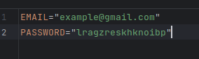

# Email Sender

This project is a FastAPI-based application for sending emails through a user-friendly interface.


## 📑 Table of Contents

- [Features](#features)
- [Installation](#installation)
- [Google Account Settings](#google-settings)
- [Usage](#usage)
- [Contributing](#contributing)

## 📚 Features

- Send emails to one or more recipients.
- Customize email subject and body.
- Attach files to emails.
- Utilizes FastAPI for efficient and high-performance API handling.

## ⚙️ Installation

1. __Clone the repository__:

```bash
git clone https://github.com/arystambek-dimash/email_sender.git
```

2. __Install the required dependencies:__

```bash
poetry install 
poetry shell
```

3. __Usage__
    1. __Run the FastAPI application__
   ```bash
    uvicorn main:app --reload
    ```
    2. __Open your web browser and go to http://localhost:8000.__
    3. __Follow the on-screen instructions to send an email.__

## 🌐 Google Account Settings

### 1. Go to your Google Account Settings:

- Visit [Google Account Settings](https://myaccount.google.com/).
- Sign in if you haven't already.

### 2. Navigate to Security:

- On the left-hand side, click on "Security" (or find it in the menu, depending on your device).

### 3. Scroll Down to App Passwords:

- Scroll down to the section labeled "App passwords" and click on "App passwords".

### 4. Sign In Again (if prompted):

- You may be asked to sign in again for added security.

### 5. Generate an App Password:

- Under "Select app," choose the app you want to generate the password for. If your app isn't listed, choose "Other (
  Custom name)".
- Under "Select device," choose the device you're using.
- Click "Generate".

### 6. Record Your App Password:

- A 16-character passcode will be displayed. This is the App Password.
- Copy this password and write in .env as this.



## 🕹 Contributing

If you'd like to contribute to this project, please follow these steps:

- Fork the repository.
- Create a new branch for your feature or bug fix.
- Make your changes and commit them.
- Push to your fork and submit a pull request.


